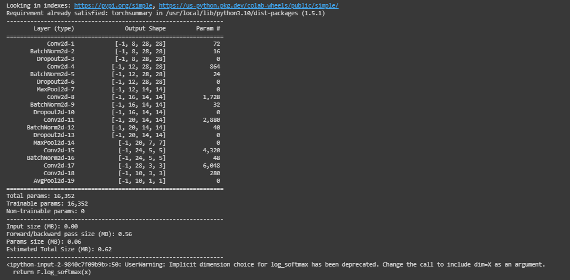

# ERA - Assignment 6

This repo is the solution for the ERA v1 assignment 6.   
The new architecture for model achieves accuracy of 99.44% with 16k parameters in 20 epochs. 


## Screenshots

Model summary for new model architecture



Model Accuracy


## Logs

```python
Epoch: 1
  0%|          | 0/938 [00:00<?, ?it/s]<ipython-input-2-9840c7f09b9b>:50: UserWarning: Implicit dimension choice for log_softmax has been deprecated. Change the call to include dim=X as an argument.
  return F.log_softmax(x)
loss=0.13330841064453125 batch_id=937: 100%|██████████| 938/938 [00:24<00:00, 37.58it/s]

Test set: Average loss: 0.0471, Accuracy: 9855/10000 (98.55%)

Epoch: 2
loss=0.06940703094005585 batch_id=937: 100%|██████████| 938/938 [00:23<00:00, 39.46it/s]

Test set: Average loss: 0.0314, Accuracy: 9898/10000 (98.98%)

Epoch: 3
loss=0.0038990008179098368 batch_id=937: 100%|██████████| 938/938 [00:24<00:00, 38.63it/s]

Test set: Average loss: 0.0286, Accuracy: 9909/10000 (99.09%)

Epoch: 4
loss=0.01119154877960682 batch_id=937: 100%|██████████| 938/938 [00:23<00:00, 39.34it/s]

Test set: Average loss: 0.0266, Accuracy: 9916/10000 (99.16%)

Epoch: 5
loss=0.002684343373402953 batch_id=937: 100%|██████████| 938/938 [00:23<00:00, 39.45it/s]

Test set: Average loss: 0.0235, Accuracy: 9921/10000 (99.21%)

Epoch: 6
loss=0.004491858184337616 batch_id=937: 100%|██████████| 938/938 [00:23<00:00, 40.22it/s]

Test set: Average loss: 0.0206, Accuracy: 9930/10000 (99.30%)

Epoch: 7
loss=0.020365657284855843 batch_id=937: 100%|██████████| 938/938 [00:23<00:00, 39.88it/s]

Test set: Average loss: 0.0233, Accuracy: 9928/10000 (99.28%)

Epoch: 8
loss=0.08725534379482269 batch_id=937: 100%|██████████| 938/938 [00:23<00:00, 39.31it/s]

Test set: Average loss: 0.0206, Accuracy: 9939/10000 (99.39%)

Epoch: 9
loss=0.018043017014861107 batch_id=937: 100%|██████████| 938/938 [00:23<00:00, 39.35it/s]

Test set: Average loss: 0.0197, Accuracy: 9936/10000 (99.36%)

Epoch: 10
loss=0.00388795742765069 batch_id=937: 100%|██████████| 938/938 [00:23<00:00, 39.50it/s]

Test set: Average loss: 0.0206, Accuracy: 9934/10000 (99.34%)

Epoch: 11
loss=0.009957347996532917 batch_id=937: 100%|██████████| 938/938 [00:23<00:00, 39.86it/s]

Test set: Average loss: 0.0209, Accuracy: 9936/10000 (99.36%)

Epoch: 12
loss=0.01728365197777748 batch_id=937: 100%|██████████| 938/938 [00:24<00:00, 39.07it/s]

Test set: Average loss: 0.0192, Accuracy: 9938/10000 (99.38%)

Epoch: 13
loss=0.014323432929813862 batch_id=937: 100%|██████████| 938/938 [00:23<00:00, 39.27it/s]

Test set: Average loss: 0.0226, Accuracy: 9936/10000 (99.36%)

Epoch: 14
loss=0.0011990648927167058 batch_id=937: 100%|██████████| 938/938 [00:23<00:00, 40.13it/s]

Test set: Average loss: 0.0180, Accuracy: 9946/10000 (99.46%)

Epoch: 15
loss=0.0004913938464596868 batch_id=937: 100%|██████████| 938/938 [00:23<00:00, 39.79it/s]

Test set: Average loss: 0.0189, Accuracy: 9939/10000 (99.39%)

Epoch: 16
loss=0.0006827114848420024 batch_id=937: 100%|██████████| 938/938 [00:22<00:00, 41.09it/s]

Test set: Average loss: 0.0220, Accuracy: 9934/10000 (99.34%)

Epoch: 17
loss=0.00245041586458683 batch_id=937: 100%|██████████| 938/938 [00:23<00:00, 40.09it/s]

Test set: Average loss: 0.0201, Accuracy: 9935/10000 (99.35%)

Epoch: 18
loss=0.0014775864547118545 batch_id=937: 100%|██████████| 938/938 [00:23<00:00, 39.99it/s]

Test set: Average loss: 0.0191, Accuracy: 9949/10000 (99.49%)

Epoch: 19
loss=0.0028286247979849577 batch_id=937: 100%|██████████| 938/938 [00:23<00:00, 40.49it/s]

Test set: Average loss: 0.0209, Accuracy: 9941/10000 (99.41%)

Epoch: 20
loss=0.001377876615151763 batch_id=937: 100%|██████████| 938/938 [00:23<00:00, 39.84it/s]

Test set: Average loss: 0.0187, Accuracy: 9944/10000 (99.44%)

```

